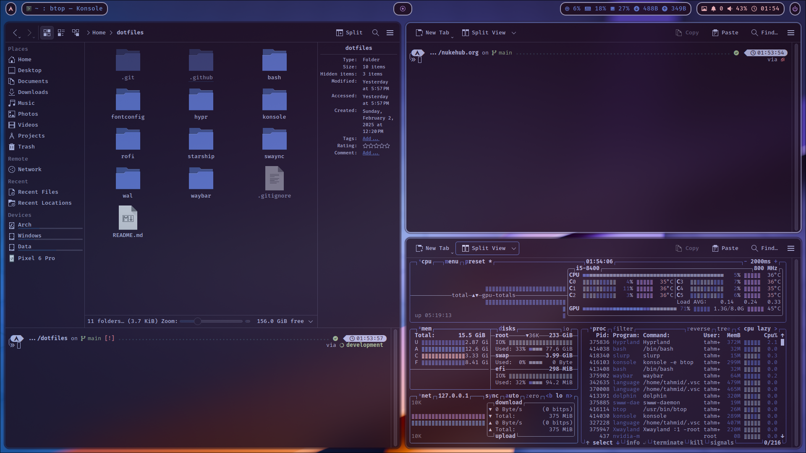

# HyprKDE

A refined Arch Linux setup combining the flexibility of KDE Plasma with the power of Hyprland, delivering a seamless hybrid desktop experience optimized for performance, aesthetics, and workflow efficiency.

## Features

- **Window Manager**: Hyprland with dynamic tiling and smooth animations.
- **Idle Daemon**: Hypridle for power-saving idle functionality.
- **Screen Locker**: Hyprlock for secure screen locking.
- **Terminal**: Konsole with Starship prompt.
- **Application Launcher**: Rofi-wayland for quick application launching.
- **Panel & Widgets**: Waybar with system monitoring and custom modules.
- **Notifications**: Swaync for modern and configurable notifications.
- **Wallpaper Manager**: Swww for smooth wallpaper transitions.
- **File Manager**: Dolphin with admin privileges enabled.
- **Font & Theming**: TTF-FiraCode-Nerd, Pywal-based dynamic theming.
- **Other Utilities**: KWalletManager, and kmix.

## Installation

### 1. Clone the repository

```bash
git clone https://github.com/ahnaf-tahmid-chowdhury/HyprKDE.git ~/dotfiles
```

### 2. Install GNU Stow

```bash
sudo pacman -S stow
```

### 3. Apply configurations

```bash
cd ~/dotfiles
stow hypr waybar rofi swaync bash starship wal fontconfig konsole
```

### 4. Reboot the system

```bash
systemctl reboot
```

## Dependencies

Ensure you have the following dependencies installed before proceeding:

### Login & Display Manager

```bash
sudo pacman -S sddm xdg-desktop-portal-gtk xdg-desktop-portal-kde xdg-desktop-portal-hyprland
```

### Window Management & Utilities

```bash
sudo pacman -S hyprland hypridle hyprlock
```

> **Note**: On first start, the `hyprpm-setup` script may automatically install required plugins such as [hyprland-plugins](https://github.com/hyprwm/hyprland-plugins) and [Hyprspace](https://github.com/KZDKM/Hyprspace). This may take a little time as Hyprland downloads and enables them in the background.
>
> If you prefer to install them manually, you can run:
>
> ```bash
> hyprpm update
> hyprpm add https://github.com/hyprwm/hyprland-plugins
> hyprpm add https://github.com/KZDKM/Hyprspace
> hyprpm enable Hyprspace
> hyprpm enable hyprexpo
> ```

### Status Bar

```bash
sudo pacman -S waybar
```

### Application Launcher

```bash
sudo pacman -S rofi-wayland
```

### Notification Daemon

```bash
sudo pacman -S swaync
```

### Theming

```bash
sudo pacman -S python-pywal plasma-workspace kde-gtk-config starship
```

### Font Configuration

```bash
sudo pacman -S fontconfig ttf-firacode-nerd
```

### Wallpaper Management

```bash
sudo pacman -S swww
```

### System Utilities

```bash
sudo pacman -S pacman-contrib power-profiles-daemon kwalletmanager
```

## Optional Dependencies

These packages are not required for the core setup but enhance usability and customization.

### File Management

```bash
sudo pacman -S dolphin kio-admin kdialog
```

### Terminal

```bash
sudo pacman -S konsole
```

### Editor

```bash
sudo pacman -S kate
```

### System Settings

```bash
sudo pacman -S systemsettings kmix
```

### Screenshot Utilities

```bash
sudo pacman -S grim slurp wl-clipboard tesseract
```

### Emoji Picker

```bash
sudo pacman -S plasma-emojier
```

### System Monitor

```bash
sudo pacman -S btop nvtop bmon
```

### Dotfile Management

```bash
sudo pacman -S stow
```

However, you can also install plasma-desktop if you want a more complete KDE experience.

```bash
sudo pacman -S plasma-desktop
```

## Gallery





